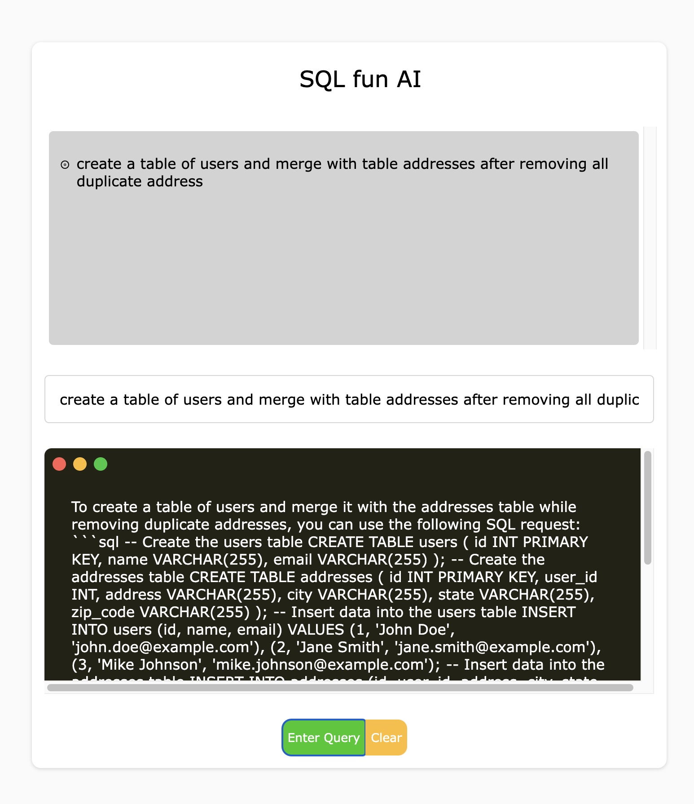

# Getting Started with Create React App

This project was created with `npx create-react-app sql-ai-gen --template typescript` and tailwind CSS.

It uses openAI API to request generation of SQL statements. User can write the request in the input field and press `Run Query`. The AI generated statements will be displayed along with the history of all requests.

Backend server uses Node/Express to access OpenAI api and protect secret using dotenv.

## Available Scripts

In the project directory, you can run:

### `npm run start-frontend`

### `npm run start-backend`

### `npm run build`
